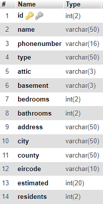

# Real Estate App 

## Overview

The Real Estate App is a console-based application designed to allow users to upload information about their estates to sell them or to allow users to browse estates currently for sale. 
Using the app, users can view all the estates currently in the system, view specific estates by entering their id number, add an estate themselves, update information about an estate already in the system, delete an estate from the system, delete all estates from the system or filter by house type, attic, basement, city and county to only show results with the desired field.
The application stores and reads the estate data from a MySQL database.

## Installation 
To install this application onto your local machine, simply clone the repository using the command and link featured below:
> git clone https://github.com/nicrowe00/Real_Estate_App.git

If you are using a Windows machine you may need to use the git command line application to use git commands which can be found here: https://git-scm.com/download/win

Once the repository has been cloned onto your local machine, to use the console version of the application, navigate to the cloned repo in your command line and use the following command:
> git checkout console

This command will automatically create a console branch that will contain all the files found on the console branch on the official GitHub repo

Open the repo in your preferred editor, such as VSCode, IntelliJ or Eclipse. 

In order to connect to a mySQL database, you must provide the details for the database in line 14 of EstateView.kts and in line 13 of FilterView.kts
The two lines should follow the format of the line below:

> val con = DriverManager.getConnection("jdbc:mysql://{yourdatabasehostname}:{yourport}/{databasename}", "{yourusername}, {"yourpassword"})

The driver required to connect to a mySQL database has already been installed and can be viewed in build.gradle.kts. The driver used in this app is 'mysql-connector-java-8.0.30'. If you wish to use a different version, you can view the code required to implement your preferred driver here: https://mvnrepository.com/artifact/mysql/mysql-connector-java

The database should contain a table titled 'estates' and should follow a structure as seen in the image below, with 'id' as the primary key:

Once the table has been created, simply run the app.